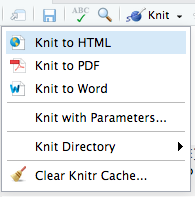
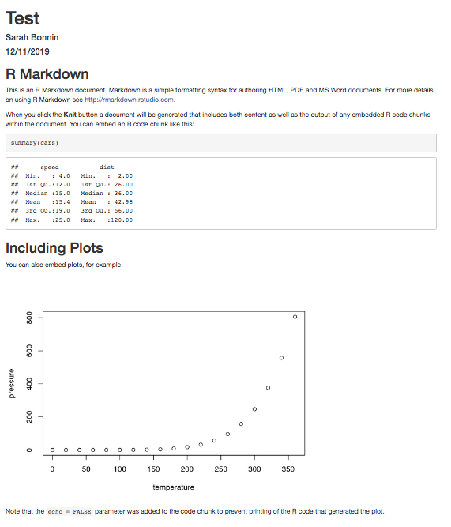

## What is Markdown ?

--

* **Lightweight markup language** 

--

* **Easy-to-read** and **easy-to-write** plain text format

--

* Rendered as **HTML** document through [Blackfriday](https://gohugo.io/getting-started/configuration/)

---

## What is R Markdown ?

--

* Advanced version of "plain" Markdown: **embeds** and **executes R code**

--

* **Simple formatting syntax** for authoring **HTML, PDF, and MS Word** documents.

--

* Easy to **report** and **share** analysis.

--

* **Reproducibility** and **transparency**.

--

* Produce **high quality documents**.

--

```{r, out.width="30%", echo=FALSE, fig.align="center"}
knitr::include_graphics("https://bookdown.org/yihui/rmarkdown/images/hex-rmarkdown.png")
```

---

## Install and load

{rmarkdown} package is **open-source** and can be installed and loaded as follows:

```{r, eval=FALSE}
install.packages("rmarkdown")
```
```{r, eval=TRUE}
library(rmarkdown)
```

```{r, eval=TRUE, echo=FALSE, message=FALSE, warning=FALSE}
library(ggplot2)
library(dplyr)
library(kableExtra)
```

---

## R Markdown Cheatsheet

R Markdown [Cheatsheet](https://rstudio.com/wp-content/uploads/2016/03/rmarkdown-cheatsheet-2.0.pdf)

---

## R Markdown (RMD) file

* Plain text file

--

* **.Rmd** extension

--

* Create, write and run from **R Studio**

---

## How does it work?

--

```{r, out.width="90%", echo=FALSE, fig.align="center"}
knitr::include_graphics("https://d33wubrfki0l68.cloudfront.net/61d189fd9cdf955058415d3e1b28dd60e1bd7c9b/b739c/lesson-images/rmarkdownflow.png")
```

--

* **{rmarkdown}** feeds the input **.Rmd** file to **{knitr}**

--

* **{knitr}** creates a new **.md** file containing the output

--

* The **.md** file is then fed to **pandoc** that creates the final output

---

## R Markdown file and rendering

Example of a **source file** and its **rendering**:

```{r, out.width="100%", echo=FALSE, fig.align="center"}
knitr::include_graphics("images/RMD_knit.png")
```

---

## Create an .Rmd file in R Studio

File -> New File -> R Markdown...

```{r, out.width="70%", echo=FALSE, fig.align="center"}
knitr::include_graphics("images/RMD_create.png")
```

---

## Create an .Rmd file in R Studio

Choose output format:

```{r, out.width="70%", echo=FALSE, fig.align="center"}
knitr::include_graphics("images/RMD_choose_output.png")
```


---

## Template .Rmd file

```{r, out.width="65%", echo=FALSE, fig.align="center"}
knitr::include_graphics("images/RMD_template.png")
```

---

## First knit!

Knit the template **.Rmd** file to HTML!

```{r, out.width="35%", echo=FALSE, fig.align="center"}

```

---

## First knit!

```{r, out.width="60%", echo=FALSE, fig.align="center"}

```

---

## Blocks

```{r echo=FALSE}
str="`\u0060`"
#**`` `r str` ``**
```

* Header (optional) in **YAML** format surrounded by **3 dashes**

--

* R code chunks surrounded by **3 back ticks**

--

* (Formatted) text

---

## Header

The YAML header is surrounded by 3 dashes (**---**)

--

```{r,eval=FALSE, echo=TRUE}
---
title: "TEST"
author: "Sarah Bonnin"
date: "12/8/2019"
output: html_document
---
```

--

Add a table of content:

--

```{r,eval=FALSE, echo=TRUE}
---
title: "TEST"
author: "Sarah Bonnin"
date: "12/8/2019"
output: 
  html_document:
    toc: true
---
```

---

## Format text

```{r, echo=TRUE, eval=FALSE}
 *Italic* / _Italic_
 **Bold** / __Bold__
 ***Bold + Italic*** / ___Bold + Italic___
 superscript^2^   
 ~~strikethrough~~  
```

--

*Italic* / _Italic_

**Bold** / __Bold__

***Bold + Italic*** / ___Bold + Italic___

Superscript^2^   
 
~~Strikethrough~~ 

---

## Format text
### Headers

````r
# Header 1
## Header 2
### Header 3
#### Header 4
````

--

# Header 1
## Header 2
### Header 3
#### Header 4

---

## Lists

### unordered

````
 * first item
 * second item
   * first sub-item
   * second sub-item
````

--

* first item
* second item
  * first sub-item
  * second sub-item

---

## Lists

### ordered

````r
 1. first ordered item
 2. second ordered item
   + first sub-item
   + second sub-item
````
    
--

1. first ordered item
2. second ordered item
  + first sub-item
  + second sub-item

---

## Code blocks
### Options

Customize the rendering with **options**:

--

```{r, out.width="95%", echo=FALSE, fig.align="center"}
knitr::include_graphics("images/RMD_options.png")
```

---

## Code blocks: examples

The following code:

````r
`r ''````{r, eval=TRUE, echo=TRUE, message=TRUE}
 ggplot(data=cars, aes(x=speed)) + geom_histogram()
```
````

--

Renders as:

```{r, eval=TRUE, echo=TRUE, message=TRUE}
 ggplot(data=cars, aes(x=speed)) + geom_histogram()
```

---

## Code blocks: examples

The following code:

````r
`r ''````{r, eval=TRUE, echo=TRUE, message=TRUE, fig.height=3}
 ggplot(data=cars, aes(x=speed)) + geom_histogram()
```
````

--

Renders as:

```{r, eval=TRUE, echo=TRUE, message=TRUE, fig.height=3}
 ggplot(data=cars, aes(x=speed)) + geom_histogram()
```

---

## Code blocks: examples

The following code:

````r
`r ''````{r, eval=TRUE, echo=TRUE, message=FALSE, fig.height=3}
 ggplot(data=cars, aes(x=speed)) + geom_histogram()
```
````

--

Renders as:

```{r, eval=TRUE, echo=TRUE, message=FALSE, fig.height=3}
 ggplot(data=cars, aes(x=speed)) + geom_histogram()
```

---

## Code blocks: examples

The following code:

````r
`r ''````{r, eval=TRUE, echo=FALSE, message=FALSE, fig.height=3}
 ggplot(data=cars, aes(x=speed)) + geom_histogram()
```
````

--

Renders as:

```{r, eval=TRUE, echo=FALSE, message=FALSE, fig.height=3}
 ggplot(data=cars, aes(x=speed)) + geom_histogram()
```

---

## Code blocks: examples

The following code:

````r
`r ''````{r, eval=FALSE, echo=TRUE, message=FALSE, fig.height=3}
 ggplot(data=cars, aes(x=speed)) + geom_histogram()
```
````

--

Renders as:

```{r, eval=FALSE, echo=TRUE, message=FALSE, fig.height=3}
 ggplot(data=cars, aes(x=speed)) + geom_histogram()
```

---

## Code blocks: examples

The following code:

````r
`r ''````{r, eval=FALSE, echo=FALSE, message=FALSE, fig.height=3}
 ggplot(data=cars, aes(x=speed)) + geom_histogram()
```
````

--

Renders as:

```{r, eval=FALSE, echo=FALSE, message=FALSE, fig.height=3}
 ggplot(data=cars, aes(x=speed)) + geom_histogram()
```

---

## Code blocks: examples (tidy)

The following code:

````r
`r ''````{r, eval=FALSE, echo=TRUE, message=FALSE, fig.height=3, tidy=TRUE}
 ggplot(data=cars,aes(x=speed))+geom_histogram()
```
````

--

Renders as:

```{r, eval=FALSE, echo=TRUE, message=FALSE, fig.height=3, tidy=TRUE}
 ggplot(data=cars,aes(x=speed))+geom_histogram()
```

---

## Code blocks

Include options globally:

````r
`r ''````{r setup, include=FALSE}
 knitr::opts_chunk$set(echo = TRUE, tidy = TRUE, message = FALSE)
```
````

---

## Code blocks: Python and bash

{rmarkdown} can also execute, for example, **bash** and **Python** blocks of code.

--

````bash
`r ''````{bash}
ls *
```
````

--

```{bash}
ls *
```

---

## Code blocks: Python and bash

{rmarkdown} can also execute, for example, **bash** and **Python** blocks of code.

--

````python
`r ''````{python}
x = 'Rladies Barcelona'
print(x.split(' '))
```
````

--

```{python, python.reticulate=FALSE}
x = 'Rladies Barcelona'
print(x.split(' '))
```

---

## Code blocks: knitr language engines

{rmarkdown} can execute **many different languages!**

--

See this [knitr language engines guide](https://bookdown.org/yihui/rmarkdown/language-engines.html)

---

## Insert images

Recommended / easier to format way with **knitr::include_graphics**:

--

````r
`r ''````{r}
knitr::include_graphics("ihttps://rladies.org/wp-content/uploads/2016/12/R-LadiesGlobal.png")
```
````

--

```{r}
knitr::include_graphics("https://rladies.org/wp-content/uploads/2016/12/R-LadiesGlobal.png")
```


---

## Insert images

Recommended / easier to format way with **knitr::include_graphics**:

--

````r
`r ''````{r, out.width="50%", echo=FALSE, fig.align="center"}
knitr::include_graphics("ihttps://rladies.org/wp-content/uploads/2016/12/R-LadiesGlobal.png")
```
````

--

```{r, out.width="50%", echo=FALSE, fig.align="center"}
knitr::include_graphics("https://rladies.org/wp-content/uploads/2016/12/R-LadiesGlobal.png")
```

---

## Links

You can **link** web pages:
--

````r
Here is a [link]("https://rmarkdown.rstudio.com/") 
to {rmarkdown} page on [R Studio](https://rstudio.com/) website.
````

--

Here is a [link]("https://rmarkdown.rstudio.com/") 
to {rmarkdown} page on [R Studio](https://rstudio.com/) website.

---

## Create tables

You can create tables:

````r
Date  | Workshop
----- | -----
12/12/2019 | R Markdown
21/01/2020 | Forecasting
````

--

Date  | Workshop
----- | -----
12/12/2019  | R Markdown
21/01/2020  | Forecasting

---

## Show R objects as tables

Format tables with **knitr::kable** and [**{kableExtra}**](http://haozhu233.github.io/kableExtra/awesome_table_in_html.html) package.

````r
`r ''````{r}
knitr::kable(head(iris))
```
````

--

```{r, echo=F}
knitr::kable(head(iris))
```

---

## Show R objects as tables

**Bold** columns

````r
`r ''````{r}
knitr::kable(head(iris)) %>%
  column_spec(1:2, bold = TRUE)
```
````

--

```{r, echo=F}
knitr::kable(head(iris)) %>%
  column_spec(1:2, bold = TRUE)
```

---

## Show R objects as tables

**Colored** rows

````r
`r ''````{r}
knitr::kable(head(iris)) %>%
  row_spec(1:3, color = "white", background = "red")
```
````

--

```{r, echo=F}
knitr::kable(head(iris)) %>%
  row_spec(1:3, color = "white", background = "red")
```

---

## Show R objects as tables

Change **font size**

````r
`r ''````{r}
knitr::kable(head(iris)) %>%
  kable_styling(font_size = 10)
```
````

--

```{r, echo=F}
knitr::kable(head(iris)) %>%
  kable_styling(font_size = 10)
```

---

## Show R objects as tables

All together

````r
`r ''````{r}
knitr::kable(head(iris)) %>%
  kable_styling(font_size = 10) %>%
  row_spec(1:3, color = "white", background = "red") %>%
  column_spec(1:2, bold = TRUE)
```
````

--

```{r, echo=F}
knitr::kable(head(iris)) %>%
  kable_styling(font_size = 10) %>%
  row_spec(1:3, color = "white", background = "red") %>%
  column_spec(1:2, bold = TRUE)
```


---

## Hands on !

Modify the **.Rmd template**:

--

* Modify global options so blocks of code are always **tidy**.

--

* **plot(pressure)**: show code but hide plot.

--

* Format **summary(cars)** with **kable** and **{kableExtra}**: highlight in yellow the "Median" row.

--

* Add the **table of content** (toc) option in the YAML header

--

* Add any modification you want (text, formatting, ...)

--

* **knit** !

---

class: inverse, center, middle

# THANK YOU !

--
*slides created with the [xaringan package](https://github.com/yihui/xaringan)*

--

Follow us on Twitter ! @RLadiesBCN

```{r, echo=FALSE, out.width="55%", fig.align="center"}
knitr::include_graphics("https://media.giphy.com/media/SMKiEh9WDO6ze/giphy.gif")
```
